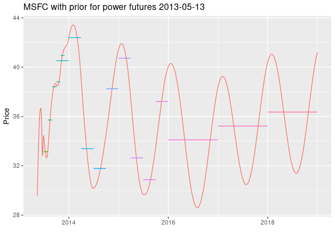
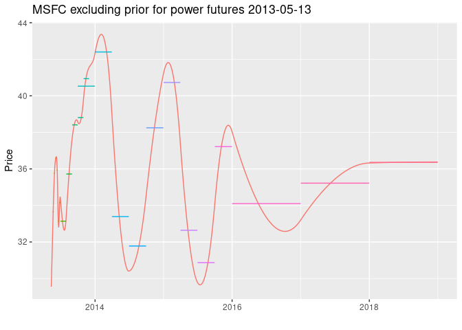
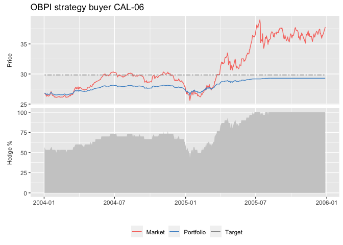
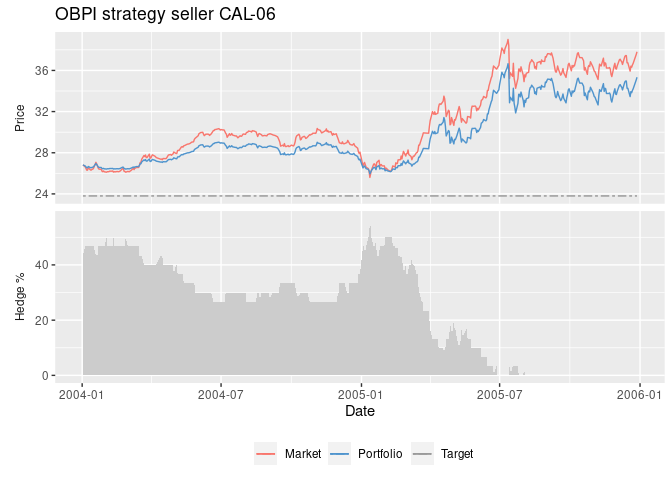

<!-- README.md is generated from README.Rmd. Please edit that file -->

# etrm: Energy Trading and Risk Management

<!-- badges: start -->

[](https://github.com/sleire/etrm/actions)
[](https://ci.appveyor.com/project/sleire/etrm)
[](https://lifecycle.r-lib.org/articles/stages.html#stable)
[](https://opensource.org/licenses/MIT)
<!-- badges: end -->

## Overview

`etrm` is an R package with tools for trading and financial risk
management in energy markets. The package currently offer tools for two
main activities:

1.  Construction of forward market curves
2.  Portfolio insurance trading strategies for energy price risk
    management

## Installation

The development version can be installed from
[GitHub](https://github.com/sleire/etrm) with:

``` r
devtools::install_github("sleire/etrm")
```

## Examples of use

The following sections provide examples using some of the synthetic data
sets included in the package.

#### 1. The Maximum Smoothness Forward Curve

A typical characteristic of energy commodities such as electricity and
natural gas is that delivery takes place over a period in time, not on a
single date. Listed futures contracts cover standardized periods, such
as “Week”, “Month”, “Quarter”, “Season” or “Year”. The forward curve is
an essential tool for pricing non-standard OTC contracts having any
settlement period. An example of such standard energy market contracts
can be found in the package data set `powfutures130513`.

    #>    Include Contract      Start        End Closing
    #> 1     TRUE   W21-13 2013-05-20 2013-05-26   33.65
    #> 2     TRUE   W22-13 2013-05-27 2013-06-02   35.77
    #> 3     TRUE   W23-13 2013-06-03 2013-06-09   36.58
    #> 4     TRUE   W24-13 2013-06-10 2013-06-16   35.93
    #> 5     TRUE   W25-13 2013-06-17 2013-06-23   33.14
    #> 6     TRUE   W26-13 2013-06-24 2013-06-30   34.16
    #> 7    FALSE  MJUN-13 2013-06-01 2013-06-30   35.35
    #> 8     TRUE  MJUL-13 2013-07-01 2013-07-31   33.14
    #> 9     TRUE  MAUG-13 2013-08-01 2013-08-31   35.72
    #> 10    TRUE  MSEP-13 2013-09-01 2013-09-30   38.41
    #> 11    TRUE  MOCT-13 2013-10-01 2013-10-31   38.81
    #> 12    TRUE  MNOV-13 2013-11-01 2013-11-30   40.94
    #> 13   FALSE    Q3-13 2013-07-01 2013-09-30   35.72
    #> 14    TRUE    Q4-13 2013-10-01 2013-12-31   40.53
    #> 15    TRUE    Q1-14 2014-01-01 2014-03-31   42.40
    #> 16    TRUE    Q2-14 2014-04-01 2014-06-30   33.39
    #> 17    TRUE    Q3-14 2014-07-01 2014-09-30   31.78
    #> 18    TRUE    Q4-14 2014-10-01 2014-12-31   38.25
    #> 19    TRUE    Q1-15 2015-01-01 2015-03-31   40.73
    #> 20    TRUE    Q2-15 2015-04-01 2015-06-30   32.64
    #> 21    TRUE    Q3-15 2015-07-01 2015-09-30   30.87
    #> 22    TRUE    Q4-15 2015-10-01 2015-12-31   37.22
    #> 23   FALSE   CAL-14 2014-01-01 2014-12-31   36.43
    #> 24   FALSE   CAL-15 2015-01-01 2015-12-31   35.12
    #> 25    TRUE   CAL-16 2016-01-01 2016-12-31   34.10
    #> 26   FALSE   CAL-17 2017-01-01 2017-12-31   35.22
    #> 27   FALSE   CAL-18 2018-01-01 2018-12-31   36.36
    #> 28   FALSE   CAL-19 2019-01-01 2019-12-31   37.44
    #> 29   FALSE   CAL-20 2020-01-01 2020-12-31   38.58
    #> 30   FALSE   CAL-21 2021-01-01 2021-12-31   39.73
    #> 31   FALSE   CAL-22 2022-01-01 2022-12-31   40.93
    #> 32   FALSE   CAL-23 2023-01-01 2023-12-31   42.15

The function `msfc()` will create an instance of the S4 class `MSFC`
with generic methods `plot()`, `summary()` and `show()`. In addition to
the arguments from the list of contracts, the user may also provide a
prior function to the calculation. This is relevant for markets with
strong seasonality, such as power markets. The default value is
`prior = 0`, but the user can provide any vector expressing a belief
regarding the market to be combined with the observed prices. In the
example below we have used a simple seasonal prior from the package
`powpriors130513` data set.

``` r
fwd_fut_wpri <- msfc(tdate = as.Date("2013-05-13"),          # trading date
                     include = powfutures130513$Include,     # vector with TRUE/FALSE, include contract?
                     contract = powfutures130513$Contract,   # vector with contract names
                     sdate = powfutures130513$Start,         # vector with contract start dates
                     edate = powfutures130513$End,           # vector with contract end dates
                     f = powfutures130513$Closing,           # vector with contract closing prices
                     prior = powpriors130513$mod.prior       # prior function
                     )

plot(fwd_fut_wpri, legend = "", title = "MSFC with prior for power futures 2013-05-13")
```



The forward curve is calculated with the function

*f*(*t*) = *λ*(*t*) + *ϵ*(*t*)

where *λ*(*t*) is the prior supplied by the user and *ϵ*(*t*) is an
adjustment function taking the observed prices into account. The
`msfc()` function finds the smoothest possible adjustment function by
minimizing the mean squared value of a spline function, while ensuring
that the average value of the curve *f*(*t*) is equal to contract prices
used in the calculation for the respective time intervals. The number of
polynomials used in the spline along with `head(prior)` and computed
prices based on the curve are available with the `summary()` method:

``` r
summary(fwd_fut_wpri)
#> $Description
#> [1] "MSFC of length 1329 built with 41 polynomials at trade date 2013-05-13"
#> 
#> $PriorFunc
#> [1] 30.10842 30.16396 30.19572 30.16144 29.06268 28.93272
#> 
#> $BenchSheet
#>    Include Contract       From         To Price  Comp
#> 1     TRUE   W21-13 2013-05-20 2013-05-26 33.65 33.65
#> 2     TRUE   W22-13 2013-05-27 2013-06-02 35.77 35.77
#> 3     TRUE   W23-13 2013-06-03 2013-06-09 36.58 36.58
#> 4     TRUE   W24-13 2013-06-10 2013-06-16 35.93 35.93
#> 5     TRUE   W25-13 2013-06-17 2013-06-23 33.14 33.14
#> 6     TRUE   W26-13 2013-06-24 2013-06-30 34.16 34.16
#> 8     TRUE  MJUL-13 2013-07-01 2013-07-31 33.14 33.14
#> 9     TRUE  MAUG-13 2013-08-01 2013-08-31 35.72 35.72
#> 10    TRUE  MSEP-13 2013-09-01 2013-09-30 38.41 38.41
#> 11    TRUE  MOCT-13 2013-10-01 2013-10-31 38.81 38.81
#> 12    TRUE  MNOV-13 2013-11-01 2013-11-30 40.94 40.94
#> 14    TRUE    Q4-13 2013-10-01 2013-12-31 40.53 40.53
#> 15    TRUE    Q1-14 2014-01-01 2014-03-31 42.40 42.40
#> 16    TRUE    Q2-14 2014-04-01 2014-06-30 33.39 33.39
#> 17    TRUE    Q3-14 2014-07-01 2014-09-30 31.78 31.78
#> 18    TRUE    Q4-14 2014-10-01 2014-12-31 38.25 38.25
#> 19    TRUE    Q1-15 2015-01-01 2015-03-31 40.73 40.73
#> 20    TRUE    Q2-15 2015-04-01 2015-06-30 32.64 32.64
#> 21    TRUE    Q3-15 2015-07-01 2015-09-30 30.87 30.87
#> 22    TRUE    Q4-15 2015-10-01 2015-12-31 37.22 37.22
#> 25    TRUE   CAL-16 2016-01-01 2016-12-31 34.10 34.10
```

The calculation without prior function, for comparison:

``` r
fwd_fut_npri <- msfc(tdate = as.Date("2013-05-13"),         # trading date
                     include = powfutures130513$Include,    # vector with TRUE/FALSE, include contract?
                     contract = powfutures130513$Contract,  # vector with contract names
                     sdate = powfutures130513$Start,        # vector with contract start dates
                     edate = powfutures130513$End,          # vector with contract end dates
                     f = powfutures130513$Closing,          # vector with contract closing prices
                     prior = 0                              # no prior function
                     )

plot(fwd_fut_npri, legend = "", title = "MSFC excluding prior for power futures 2013-05-13")
```



The daily forward curve values can be found along with the prior
function and contracts used in the calculation with the `show()` method.
An instance of `MSFC` is a rather rich object, and further details
regarding the calculation, spline coefficients, etc. can be found in the
slots:

``` r
slotNames(fwd_fut_wpri)
#> [1] "Name"        "TradeDate"   "BenchSheet"  "Polynomials" "PriorFunc"  
#> [6] "Results"     "SplineCoef"  "KnotPoints"  "CalcDat"
```

#### 2. Portfolio Insurance Trading Strategies for Energy Price Risk Management

Futures trading strategies for price risk management, for commercial
hedgers with long or short exposure. All models below aim to achieve a
favorable unit price for the energy portfolio, while preventing it from
breaching a pre defined cap (floor).

The functions

-   `cppi()` - Constant Proportion Portfolio Insurance  
-   `dppi()` - Dynamic Proportion Portfolio Insurance  
-   `obpi()` - Option Based Portfolio Insurance  
-   `shpi()` - Step Hedge Portfolio Insurance  
-   `slpi()` - Stop Loss Portfolio Insurance

implement alternative approaches to achieve this goal. They return S4
objects of type `CPPI`, `DPPI`, `OBPI`, `SHPI` and `SLPI` respectively,
with methods `plot()`, `summary()` and `show()`.

In our example, we will consider the CAL-06 contract in the synthetic
`powcal` data set, and start trading 500 days prior to the contract
expiry. For the `OBPI`strategy presented below, the target price is
calculated as an expected cap (floor) given by the option
premium-adjusted strike price selected for the delta hedging scheme
within a standard Black-76 option pricing framework. The default strike
price is set at-the-money. The user may express a view regarding future
market development by deviating from this level.

``` r
cal06_obpi_b <- obpi(q = 30,               # volume 30 MW (buyer)
                     tdate = dat06$Date,   # vector with trading days until expiry
                     f = dat06$CAL06,      # vector with futures price
                     k = dat06$CAL06[1],   # default option strike price at-the-money
                     vol = 0.2,            # annualized volatility, for the Black-76 delta hedging
                     r = 0,                # default assumed risk free rate of interest
                     tdays = 250,          # assumed trading days per year
                     daysleft = 500,       # number of days to expiry
                     tcost = 0,            # transaction cost
                     int = TRUE            # integer restriction, smallest transacted unit = 1
                   )

plot(cal06_obpi_b, legend = "bottom", title = "OBPI strategy buyer CAL-06")
```



The `summary()` method:

``` r
summary(cal06_obpi_b)
#> $Description
#> [1] "Hedging strategy of type OBPI and length 500"
#> 
#> $Volume
#> [1] 30
#> 
#> $Target
#> [1] 29.83626
#> 
#> $ChurnRate
#> [1] 4.333333
#> 
#> $Stats
#>       Market Trade Exposed Position     Hedge   Target Portfolio
#> First  26.82    17      13       17 0.5666667 29.83626  26.82000
#> Max    39.01    17      17       30 1.0000000 29.83626  29.29433
#> Min    25.60    -3       0       13 0.4333333 29.83626  26.46833
#> Last   37.81     0       0       30 1.0000000 29.83626  29.29433
```

The `show()`method provide details regarding daily values for market
price, transactions, exposed volume, futures contract position, the
target price and the calculated portfolio price. Further details for a
specific instance of a trading strategy can be found in the slots, see
for example:

``` r
slotNames(cal06_obpi_b)
#>  [1] "StrikePrice"  "AnnVol"       "InterestRate" "TradingDays"  "Name"        
#>  [6] "Volume"       "TargetPrice"  "TransCost"    "TradeisInt"   "Results"
```

The CAL-06 OBPI strategy from a sellers point of view:

``` r
cal06_obpi_s <- obpi(q = - 30,             # volume -30 MW (seller)
                     tdate = dat06$Date,   # vector with trading days until expiry
                     f = dat06$CAL06,      # vector with futures price
                     k = dat06$CAL06[1],   # default option strike price at-the-money
                     vol = 0.2,            # annualized volatility, for the Black-76 delta hedging
                     r = 0,                # default assumed risk free rate of interest
                     tdays = 250,          # assumed trading days per year
                     daysleft = 500,       # number of days to expiry
                     tcost = 0,            # transaction cost
                     int = TRUE            # integer restriction, smallest transacted unit = 1
                   )

plot(cal06_obpi_s, legend = "bottom", title = "OBPI strategy seller CAL-06")
```


